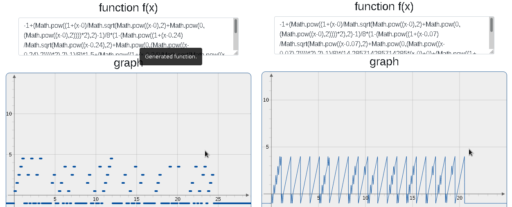

# text-to-graph-of-a-function

This tool turns text to a graph of a function.

This is done by using some of the following relational operators. These functions do only work in graph plotters that define 0^0 = 1.

| Relational operator | Formula                                           |
|---------------------|---------------------------------------------------|
| equal(a,b)          | 0^((a-b)^2)                                       |
| not_equal(a,b)      | 1-0^((a-b)^2)                                     |
| greater(a,b)        | ((1+(a-b)/((a-b)^2+0^((a-b)^2))^(1/2)*2)^2-1)/8   |
| less(a,b)           | ((1+(b-a)/((b-a)^2+0^((b-a)^2))^(1/2)*2)^2-1)/8   |
| greater_equal(a,b)  | 1-((1+(b-a)/((b-a)^2+0^((b-a)^2))^(1/2)*2)^2-1)/8 |
| less_equal(a,b)     | 1-((1+(a-b)/((a-b)^2+0^((a-b)^2))^(1/2)*2)^2-1)/8 |
